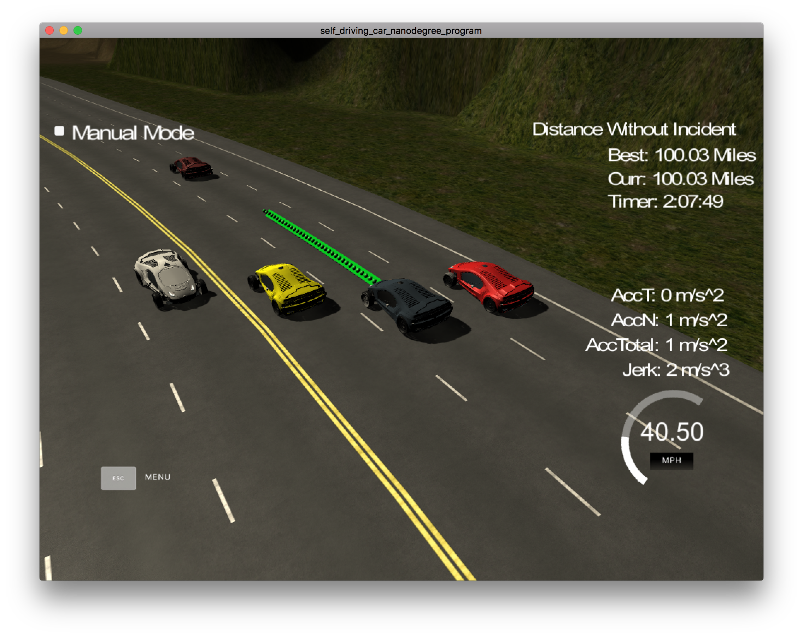
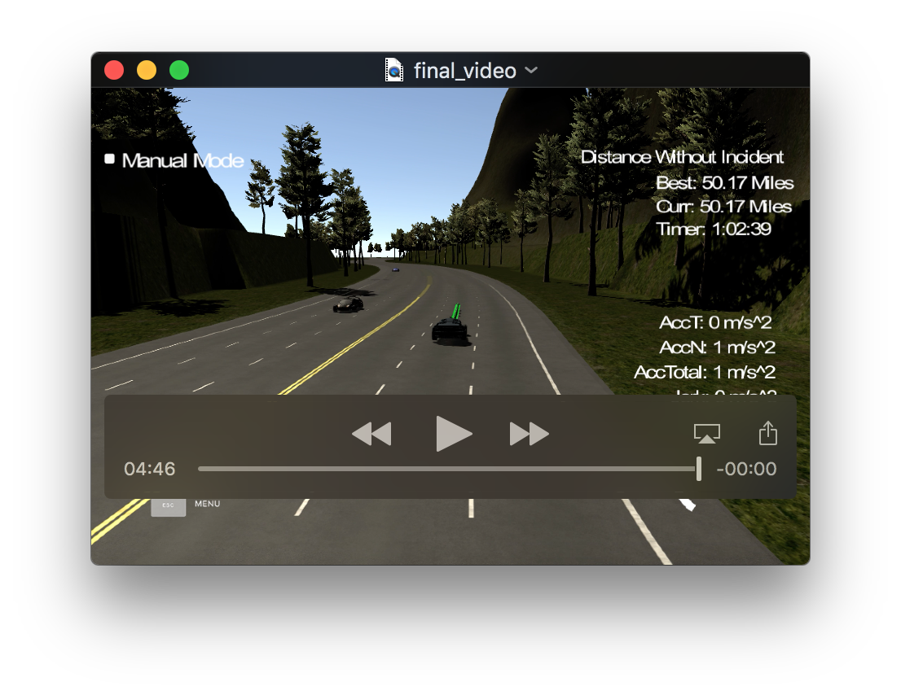
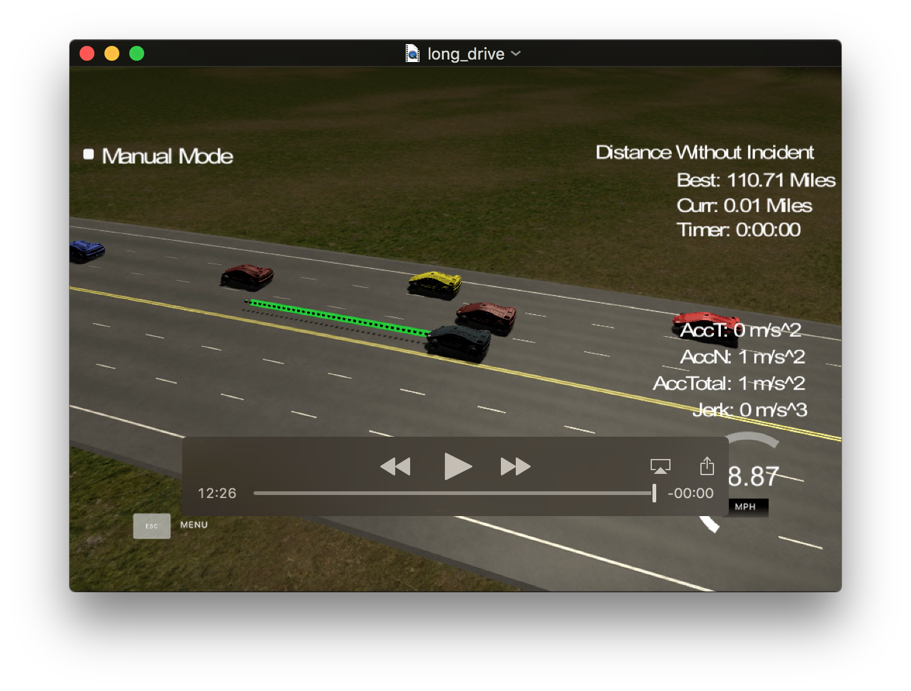
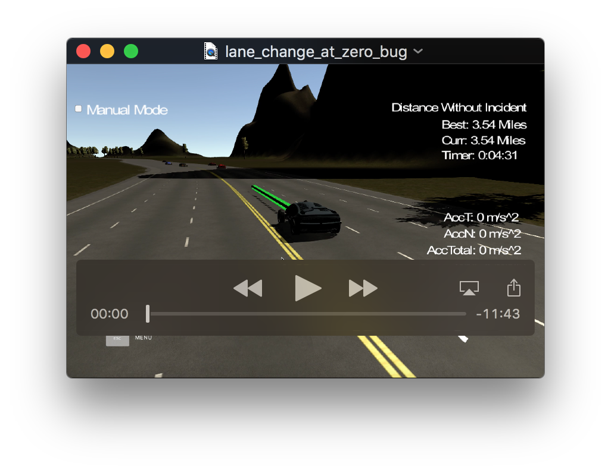

# Path Planning Project

Overview
---
This repository contains my submission for the Path Planning Project, which is part of the curriculum for term 3 of the Udacity Self-Driving Car Engineer Nanodegree Program. The goal of this project is to design a path planner that is able to create smooth, safe paths for the car to follow along a 3 lane highway with traffic. A successful path planner will be able to keep inside its lane, avoid hitting other cars, and pass slower moving traffic all by using localization, sensor fusion, and map data. The code for my model predictive controller can be found [here](./src). See the project rubric [here](https://review.udacity.com/#!/rubrics/1020/view). 

[//]: # (Image References)
[image1]: logistic_function.png "Logistic function"
[image2]: distance_function.png "Cost vs distance"
[image3]: lane_speed_function.png "Cost vs lane speed"

### Overall Approach
I started with the source code from the Project Walkthrough. This was enough to get the car driving smoothly in lanes and adjusting its speed to remain behind cars. While the walkthrough showed how to implement a lane change, it did not show how to determine when a lane change should be executed.

I initially tried to implement this behavior by creating a BehaviorPlanner class that took as input the sensor fusion data from the simulator. This class contained "if then else" logic to choose the lane to be in based on the location of the cars detected by sensor fusion. After spending a few days on this approach, I realized that doing so would result in a mess of spaghetti code that would be difficult to maintain.

I referred back to the lessons provided in the behavior planning section of the course materials and, in particular, to the section on behavior planning. Lesson 21 in this section provided the C++ source code for a rudimentary, cost function-based behavior planner which would select the right lane for a vehicle based on the speeds and positions of the other cars that it is currently sharing the road with. The basic idea is that we assign a cost to being in each lane. At each time step, the lane with the lowest cost is chosen for the vehicle. Collisions are avoided because close proximity to a vehicle that would likely result in a collision is penalized with a very high cost. If the lane chosen for a time step is not the current lane, then a lane change is initiated. I decided that I would use this code and adapt it for my purposes. 

The actual implementation uses a Trajectory object which is a vector of [Vehicle](./src/vehicle.cpp) objects. Vehicle objects represent the position and speed of the vehicle at a particular point in time. The position is stored as the lane and a Frenet s coordinate. With each iteration through my control loop I create up to three trajectories: (1) Keep Lane (KL) (2) Lane Change Left (LCL) and (3) Lane Change Right (LCR). These 3 trajectories correspond to the available states for the vehicle. I say "up to" 3 trajectories because not all 3 trajectories/states are generated with each iteration. For example, if the vehicle is in the left lane, then the only available next states are: KL and LCR. Similarly, if the vehicle is in the right lane, then only KL and LCL are available. In fact, in the implementation that I used I also disallow lane changes when our vehicle is within 3 car lengths of a vehicle in the lane that we are trying to change to. The logic for doing this can be found in the generate_trajectory, keep_lane_trajectory, and lane_change_trajectory methods of the [Vehicle class](./src/vehicle.cpp). 

The pseudocode for calculating the optimum trajectory at each point in time is as follows:

    For each successor state from the current state of the vehicle. 
        Create a candidate trajectory for that state. 
        Calculate the total cost for the trajectory. 
    Pick the lowest cost trajectory. 
    Execute the trajectory (changing lanes and adjusting speed if necessary).     

### Cost Functions
Once I got the cost function infra-structure from lesson 21 compiled and working in my environment, the next challenge was to design the cost functions that would choose the right lane to be in at any given time. I decided to create functions that would vary based on the following factors: 

| Cost Function | Description | Variance |
|:-----:|:-------------:|:----------:|
| Lane Speed  | A faster lane should have a lower cost.  | Proportional |
| Proximity  | Being close to another vehicle should have a higher cost.  |Proportional |
| Lane Proximity  | Being close to another vehicle in your own lane should have a higher cost.  |Proportional |
| Middle Lane Cost  | Not being in the middle lane should have a higher cost.  | Binary |
| Lane Change Cost  | Changing lanes carries inherent risk that should be reflected in the cost. This reduces lane "hunting".  | Binary |
| Collision Cost  | Being close enough to a vehicle that you make contact with it should have an extremely high cost.  | Binary |

The table above characterizes each one of my proposed cost function. Each function would be scaled to vary from 0 to 1 and then I would apply a weight to each one to vary its effect on the overall cost. The variance column specifies whether the cost value that is returned should be proportional or binary. The code that implements my cost functions can be found [here](./src/cost.cpp).

The proportional cost functions are not necessarily linear. For example, looking at proximity, there should be a large difference between the cost of a vehicle being within 1 meter of another car as opposed to being within 20 meters of another car. But the difference between a car being 50 meters away as opposed to being 100 meters away, should be small. I decided that this proportionality was best implemented with a logistic function. I eventually chose the following function:

    2.0/(1+exp(-x))-1.0

The figure below shows what this logistic function looks like.

![alt text][image1]

Notice that this function has a maximum of 1 (for positive x) and varies significantly over a range  -4.0 < x < 4.0 but shows little variation for values of x outside of this range.

For my proximity functions where I am assigning a cost to how close my car is to another car, I use the following function for the x value in the logistic function:

x=2*car_size/distance

In my case, car_size=2. So my final cost function for proximity to another car looks as follows:

![alt text][image2]

The cost versus distance profile shown here is exactly what I was looking for. This function is used in both the proximity_cost and in_lane_proximity_cost functions which can be found in [costs.cpp](./src/cost.cpp). 

For the lane speed cost function, which penalizes lanes where the cars are moving at a slower speed, there was a choice to make as to whether we need the non-linearity introduced by the logistic function. I eventually decided that the best way to scale the lane speed cost to 1 was to use the following function:

(SPEED_LIMIT - lane_speed) / SPEED_LIMIT

The output of this function will be 1 when the lane_speed is zero, 0.5 when the lane_speed is half the speed limit and 0 when our car is travelling at the speed limit. The image below compares using the lane speed function above as the "x" value in the logistic function to just using the lane speed function directly as the cost function. I used 21.85 as the speed limit in both cases:

![alt text][image3]

You can see that using the function directly was roughly equivalent to using the logistic function multiplied by 2. Given that, I decided to save a few CPU cycles and not use the logistic function. 

The final 3 components of our cost function: (1) the middle lane cost, (2) lane change cost, and (3) collision cost are all binary functions. This means they test for The presence of some condition and if that condition is met they return 1, otherwise they return 0. The middle lane function returns 1 if the user is not in the middle lane and 0 if it is. The purpose is to assign a lower cost to being in the middle lane so that it is favored. From the standpoint of moving quickly through traffic, the middle lane is the best place to be because all lanes are accessible. The lane change cost function returns 1 for a trajectory that involves a lane change and 0 for one that does not. The purpose of this function is to minimize lane hunting. In a situation where there is little cost differential between lanes, such as a wide-open road, the car may hunt around for the right lane. The collision cost function is one of the most important sub-components of the overall cost function. It returns 1 for a trajectory that would bring the car close enough to another car that a collision is likely, otherwise it returns 0. A weight that is an order of magnitude higher than any of the others will be used on this cost function so that the cars highest priority in choosing its path is to avoid a collision with another vehicle.

### Tuning the Weights
With all of the components of our overall cost function defined, the total cost for each generated trajectory is given as follows:

Total Cost=W1*LaneSpeedCost + W2*ProximityCost + W3*LaneProximityCost + W4*MiddleLaneCost + W5*LaneChangeCost + W6*CollisionCost

Where W1 thru W6 are the weights associated with the cost component that they are multiplied by.

To determine these weights, I started by doing dimensional analysis. This is simple since all of the cost components are scaled to 1. I assumed that I wanted the lane speed to trump the middle lane and lane change values added together for a typical component value. I also wanted close proximity to trump lane speed. After playing around with these numbers, I came up with the following starting point.  

| Weight | Description | Value | Typical Component Value |
|:-----:|:-------------:|:----------:|:----------:|
| W1  | Lane speed  | 5000 | 0.2 (17.8 MPH) |
| W2  | Proximity  | 2000 | 0.2 (10 meters) |
| W3  | Lane Proximity  | 2000 | 0.2 (10 meters) |
| W4  | Middle Lane  | 500 | 1 |
| W5  | Lane Change  | 400 | 1 |
| W6  | Collision  | 10000 | 1 |

With these weights the car drove fairly well. It almost passed the rubric right out of the box. However, I felt that the car was not as aggressive I would like about seeking a faster lane. So I bumped up the lane speed weight to 7000. This improved my cars aggressiveness in seeking a faster lane. But I noticed that there was some times where my car could make headway further down the track, but it resolutely stayed behind another car. I reasoned that I could improve my cars willingess to seek a lane with space to advance my car down the road by turning down the proximity weight. I also noticed a willingess of my car to follow to closely behind cars in its lane. So I turned up the lane proximity weight. At this point, I had the following set of weights.

| Weight | Description | Value | 
|:-----:|:-------------:|:----------:|
| W1  | Lane speed  | 5000 | 
| W2  | Proximity  | 250 | 
| W3  | Lane Proximity  | 4000 | 
| W4  | Middle Lane  | 500 |
| W5  | Lane Change  | 400 | 
| W6  | Collision  | 10000 | 

My car was actually driving pretty well at this point even passing the rubric on some runs. I added copious amount of logging to my classes so I could see exactly what went on when the car did not behave the way that I wanted it to. I did a little more tweaking evaluating accidents as they arose to see if I could have prevented the problem by tweaking weights. I even created an Excel spreadsheet that implemented all of my cost functions, so I could play out "what if" scenarios with new weights. After a few days of tweaking, I wound up with the following set of weights. 

| Weight | Description | Value | 
|:-----:|:-------------:|:----------:|
| W1  | Lane speed  | 4000 | 
| W2  | Proximity  | 100 | 
| W3  | Lane Proximity  | 6000 | 
| W4  | Middle Lane  | 500 |
| W5  | Lane Change  | 400 | 
| W6  | Collision  | 10000 | 

Unfortunately, one casualty of this set of weights was the functionality that favored the middle lane. However my car was knifing its way through traffic fairly well and collisions were rare, so I decided to quit while I was ahead. The following video shows my car in action at the end of a 50 mile run with no incidents.

    

My longest run without incident clocked in at 110 miles. After I corrected the last of the problems that was curtailing some of my longer runs (see the problems encountered section) I set my car running and went to dinner with my family. I came back more than 2 hours later to find the car still running without incident. I captured the last 8 minutes of that run in the video below. You can fast-forward to the end to see how the run ended. The end came as the result of some very dangerous driving on the part of the other cars. 

### Problems Encountered

After I got the cost functions tuned, my car would go more than 4.32 miles on most runs, but I noticed my car was occasionally turning into a car that it was passing. I spent a lot of time adding logging and video recording the car. And what I saw is that the frenet coordinates that were being calculated for my car at each time step were not increasing montononically. In reviewing the logs after one of these crashes, I noticed that the sequence of s values was as follows: 2028, 2034, 2036, 2057, 2054, 2050, 2048, 2051, 2055, 2058. Notice there is a big jump in the s coordinate from 2036 to 2057 and then the value starts going backwards for 5 data points before it starts increasing again. This is as though the car was going backwards. The big jump from 2036 to 2057 causes the car to think it is farther down the track than it is which triggers a lane change right into a car. There appears to be a problem with either the x and y coordinates being returned by the simulator or with the conversion to Frenet coordinates. All of the code that I was using for this was either part of the starter code or was included in the project walkthrough. 

 I worked around this issue by implementing a filter of sorts. I maintain a rolling average of the last 10 increments to s. If I see a big jump, like the one from 2036 to 2057 above, I ignore the value calculated from the Frenet conversion and use the rolling average for either 10 increments or until the new s values calculated from the average match up (within some tolerance) with the new s value coming in from the Frenet conversion. This essentially smooths over those spikes I was seeing. Before I made this change my car was going 4-8 miles with each run. After this change it was consistently going 12 to 20 miles betweeen incidents. 

After I fixed the problem described above I noticed that my typical runs would go 12 to 20 miles and they usually ended with my car making an inexplicable lane change right into another car at the start/finish line of the track where the s coordinate changes from 6945 back to 0. The video below shows one such incident which happened to occur as I was recording videos to include in this writeup. 

I have lots of logging in my classes and I dug in to see if I could understand what was going on. What I discovered was that the first coordinate returned in the sensor fusion data after the s coordinate rolls over from 6945 to 0 always shows 0 for the lane. Once we get the second reading, after the s value rolls over, the problem goes away. 

With this fact, the sequence of events that occur at the end of the video above is explainable. The yellow car in lane 0 is car #5 in the sensor fusion data. The yellow car in lane 2 is car #11. My car momentarily thinks that car #11 is in lane 0 because of the bug described above. If car #11 is in lane 0, then lane 2 is wide open. My cost function calculates that this is the lowest cost lane and changes lanes into it. Almost immediately thereafter, car #11 reappears in lane 2. Take a look at the log entries below which were cut and pasted from the log file that was captured at the same time that the video above was recorded. 

The Frenet s coordinate of the car is logged at the beginning of each time step. So each time you see the text "START ITERATION" a new time step has begun and the "S_VALUE" shown is the s coordinate of the car at that time step. Notice at the first time step shown below (S_VALUE=6939) vehicle 11 is shown in lane 2 with a raw s value of 6929 and a predicted value at 6946. I have an ADAS feature implemented in my car that disables a lane change if changing lanes would likely cause a collision. You can see that my ADAS correctly disallows both lane changes. Rewatch the video and note that my car is in lane 1 and vehicle 5 and vehicle 11 in the sensor fusion data are the yellow cars to the left and right of my car respectively. If you scroll a couple of time steps onward in the log file, you can the iteration step for S_VALUE=3.53. We have crossed the start/finish line of the track. If we look at the sensor fusion data you can see that vehicle 11's position is reported as s=0, with the lane value=0 instead of 2. Note from the video that neither car changed lanes. This is obviously incorrect. With the car no longer detected in lane 2, my cost function calculates the lowest cost for lane 2 and initiates a lane change which causes a collision. Notice that if you keep scrolling down and look at the sensor fusion data for S_VALUE=14.694, you can see that once the next s value arrives, vehicle 11 is shown in lane 2 again. 

I wanted to see my car to go further between incidents, so I implemented a work-around by disallowing lane changes on my car after it passes an s coordinate of 6920. If we cannot rely on the sensor fusion data to be accurate in this portion of the track, it is best now allow a lane change to occur there. After making this change my car went over 110 miles without incident. 

****** START ITERATION  S_VALUE=6939.01 *****
**** SENSOR FUSION DATA ****
Raw: s=6926.6, d=2.51301, v=18.0566
For vehicle 5 predictions=
s=6926.6, s[first]=6926, s[last]=6943, lane=0

Raw: s=6929.07, d=10.3425, v=17.4656
For vehicle 11 predictions=
s=6929.07, s[first]=6929, s[last]=6946, lane=2

Lane change LCL is not possible this->s=6939 next lane vehicle.s=6943
Lane change LCR is not possible this->s=6939 next lane vehicle.s=6946

****** START ITERATION  S_VALUE=3.53052 *****
**** SENSOR FUSION DATA ****
Raw: s=0, d=0, v=18.0578
For vehicle 5 predictions=s=0, s[first]=0, s[last]=17, lane=0

Raw: s=0, d=0, v=17.4616
For vehicle 11 predictions=s=0, s[first]=0, s[last]=17, lane=0

*** Cost for lane 2 = 838.007 ***
*** CHANGE LANES AND GO! ***
Old lane=1, new lane=2

****** START ITERATION  S_VALUE=14.694 *****
**** SENSOR FUSION DATA ****
Raw: s=0, d=0, v=18.0617
For vehicle 5 predictions=s=0, s[first]=0, s[last]=17, lane=0

Raw: s=0.212128, d=10.1208, v=17.4462
For vehicle 11 predictions=s=0.212128, s[first]=0, s[last]=17, lane=2

